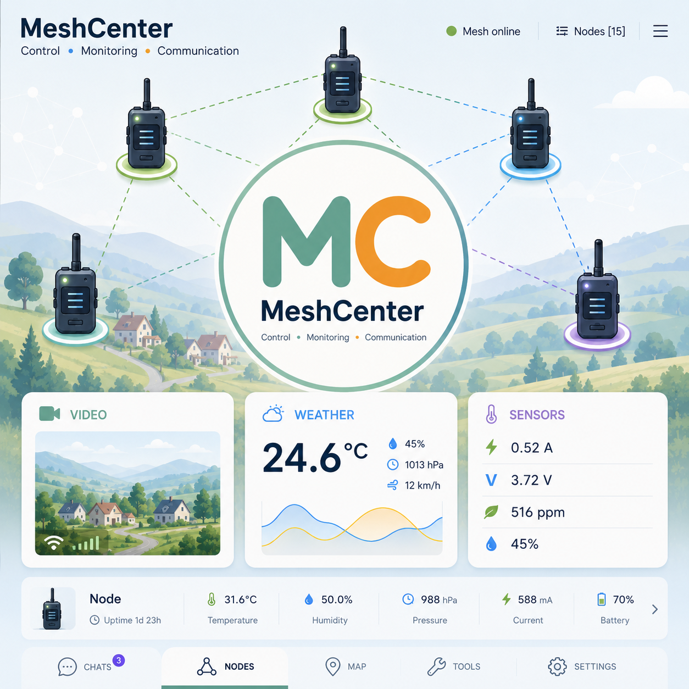

<p align="center">
  <!-- Project logo -->
  
</p>

<h1 align="center">MeshCenter</h1>

<p align="center">
A complete browser-based control center for Meshtastic® base stations running on Raspberry Pi.
</p>

<p align="center">


</p>

---

# Overview

**MeshCenter** is a modern browser-based control center designed specifically for Meshtastic base stations running on Raspberry Pi.

Instead of depending solely on a mobile application, MeshCenter provides a permanent web interface that is available from any device connected to your local network. It combines messaging, telemetry, camera streaming, photo management and node administration into a single lightweight application.

The project is optimized for Raspberry Pi Zero 2W while remaining fully compatible with more powerful Raspberry Pi models.

Unlike a traditional web interface, MeshCenter is designed as a complete control center that continuously runs alongside a Meshtastic node, providing real-time monitoring and convenient management through any modern web browser.

---

# Why MeshCenter?

The official Meshtastic applications are excellent for configuration, mobile operation and everyday communication.

MeshCenter is **not intended to replace them**.

Instead, it complements the official ecosystem by providing a permanent browser-based control center for fixed stations, gateways and Raspberry Pi based installations.

Typical use cases include:

- Home base stations
- Portable field communication servers
- Emergency communication nodes
- Raspberry Pi gateways
- Weather monitoring stations
- Remote telemetry systems
- Educational and experimental projects

---

# Highlights

## 💬 Messaging

- Public channel messaging
- Direct messages
- Automatic chat updates
- Chat history
- Favorite contacts
- Ignore list
- Message export

---

## 📷 Camera

- Live MJPEG video streaming
- High-resolution photo capture
- Integrated photo gallery
- Adjustable image quality
- Adjustable FPS
- Raspberry Pi Camera support

---

## 📈 Telemetry

- Device telemetry
- Environmental sensors
- Battery monitoring
- Power monitoring
- Historical charts
- Automatic refresh

---

## 📡 Node Management

- Automatic node discovery
- Hardware information
- RSSI / SNR monitoring
- Favorites
- Ignore list
- Import / Export

---

## ⚡ Optimized for Raspberry Pi

MeshCenter has been developed with Raspberry Pi Zero 2W as the primary target platform.

Special attention has been paid to:

- Low memory usage
- Low CPU utilization
- Fast page loading
- Lightweight architecture
- Stable 24/7 operation

---

# Screenshots


# Design Philosophy

MeshCenter follows a few simple principles.

- Browser-first experience
- Fast and responsive interface
- Reliable long-term operation
- Low resource consumption
- Simple installation
- Easy maintenance
- Full compatibility with the official Meshtastic ecosystem

The goal is to provide a practical and reliable control center that can run continuously on a Raspberry Pi while giving convenient access to the most important functions of a Meshtastic base station from any web browser.

---

# What Makes MeshCenter Different?

Unlike traditional web interfaces, MeshCenter is designed as a complete operational environment for a Meshtastic base station.

It combines multiple independent subsystems into one application:

- Messaging
- Camera
- Photo Gallery
- Telemetry
- Node Management
- Local Data Storage
- Background Services
- REST API

This modular architecture makes it easy to extend the project while keeping the user interface simple and responsive.

---
# Installation

MeshCenter is designed to run on Raspberry Pi OS Bookworm and newer versions.

Although it has been primarily developed and tested on Raspberry Pi Zero 2W, it also works on Raspberry Pi 3, 4 and 5.

## Requirements

### Hardware

- Raspberry Pi Zero 2W or newer
- microSD card (16 GB or larger recommended)
- Meshtastic compatible LoRa device
- Raspberry Pi Camera (optional)
- Wi-Fi connection

### Software

- Raspberry Pi OS Bookworm (64-bit recommended)
- Python 3.13 or newer
- Meshtastic CLI
- Git

---

# Clone the Repository

```bash
git clone https://github.com/FlintUA/MeshCenter.git
cd meshcenter
```

---

# Create a Virtual Environment

```bash
python3 -m venv venv
source venv/bin/activate
```

---

# Install Dependencies

```bash
pip install --upgrade pip
pip install -r requirements.txt
```

Depending on your configuration you may also need to install additional packages such as:

```bash
pip install meshtastic pillow
```

Camera support requires the Raspberry Pi camera stack to be installed and enabled.

---

# Configuration

Copy the example configuration file.

```bash
cp config.example.py config.py
```

Edit the configuration.

```bash
nano config.py
```

Typical configuration options include:

```python
APP_HOST = "0.0.0.0"
APP_PORT = 5000

MESHTASTIC_CMD = "/home/_your_profile_directory_/.local/bin/meshtastic"
MESHTASTIC_PORT = "/dev/ttyACM0"

LOCAL_NODE_ID = "!xxxxxxxx"
LOCAL_NODE_NAME = "My Base Station"

DATA_DIR = "/home/_your_profile_directory_/meshcenter/data"
```

Adjust these values to match your installation.

---

# Verify Meshtastic CLI

Before starting MeshCenter, make sure that Meshtastic CLI is working correctly.

```bash
meshtastic --info
```

or

```bash
meshtastic --port /dev/ttyACM0 --info
```

If the command displays information about your node, MeshCenter should also be able to communicate with it.

---

# Starting MeshCenter

Run manually:

```bash
source venv/bin/activate

python server.py
```

The web interface will be available at:

```
http://<raspberry-pi-ip>:5000
```

Example:

```
http://192.168.2.103:5000
```

---

# Running as a Service

For permanent installations, MeshCenter is intended to run as a systemd service.

Example service file:

```ini
[Unit]
Description=MeshCenter
After=network.target

[Service]
Type=simple
User=your_user_name

WorkingDirectory=/home/_your_profile_directory_/meshcenter

Environment="PATH=/home/_your_profile_directory_/meshcenter/venv/bin:/usr/local/bin:/usr/bin:/bin"
Environment="PYTHONUNBUFFERED=1"

ExecStart=/home/_your_profile_directory_/meshcenter/venv/bin/python /home/_your_profile_directory_/meshcenter/server.py

Restart=always
RestartSec=10

StandardOutput=journal
StandardError=journal

CPUQuota=70%
MemoryMax=200M

[Install]
WantedBy=multi-user.target
```

Enable the service:

```bash
sudo systemctl enable meshcenter
sudo systemctl start meshcenter
```

Check its status:

```bash
systemctl status meshcenter
```

View the log:

```bash
journalctl -u meshcenter -f
```

---

# Updating MeshCenter

Update the repository:

```bash
git pull
```

Activate the virtual environment.

```bash
source venv/bin/activate
```

Install new dependencies if required.

```bash
pip install -r requirements.txt
```

Restart the service.

```bash
sudo systemctl restart meshcenter
```

---

# Updating Meshtastic CLI

It is recommended to keep Meshtastic CLI up to date.

Upgrade using pip:

```bash
pip install --upgrade meshtastic
```

Verify the installed version:

```bash
meshtastic --version
```

---

# Directory Layout

A typical installation looks like this:

```text
meshcenter/

├── api/
├── camera/
├── meshsrv/
├── static/
├── storage/
├── telemetry/
├── templates/
├── utils/

├── data/
├── docs/
├── venv/

├── config.py
├── config.example.py
├── requirements.txt
├── server.py
└── README.md
```

The `data` directory stores persistent information such as messages, telemetry history and application settings.

# Core Features

MeshCenter combines several independent subsystems into one control center. Each subsystem is designed to be useful on its own, but together they turn a Raspberry Pi into a practical Meshtastic base station.

---

## 💬 Messaging

MeshCenter provides a browser-based chat interface for Meshtastic communication.

The messaging system supports both public channel messages and direct node-to-node messages.

### Public Channel

Public messages are sent to the configured Meshtastic channel, usually LongFast channel index `0`.

Typical use cases:

- Local mesh chat
- Community messages
- Field communication
- Test messages
- Sensor status announcements

### Direct Messages

MeshCenter also supports direct messages between nodes.

Direct messages are shown as separate chats, making it easier to work with multiple known nodes from a browser interface.

### Messaging Features

- Public channel messaging
- Direct node-to-node messaging
- Chat history
- Automatic message refresh
- Message timestamps
- Favorite chats
- Ignore list
- Emoji picker
- System messages
- Local JSON-based storage

---

## 📡 Node Management

MeshCenter automatically discovers nodes from the Meshtastic mesh and stores them locally.

The node list helps you understand what devices are visible in your area and when they were last heard.

### Node Information

Depending on the available data, MeshCenter can display:

- Long name
- Short name
- Node ID
- Hardware model
- Role
- Last seen time
- RSSI
- SNR
- Hop distance
- Last message

### Favorites

Frequently used nodes can be marked as favorites.

Favorites are useful for:

- Your own devices
- Family nodes
- Field team nodes
- Known repeaters
- Important contacts

### Ignore List

Nodes that are not relevant can be ignored.

Ignored nodes remain in the database, but they can be hidden from the main view and filtered out from normal interaction.

This is useful in busy areas where many nodes are visible but only a few are important for your setup.

### Import and Export

MeshCenter supports importing and exporting the local node database.

This is useful for:

- Backups
- Moving to another Raspberry Pi
- Keeping a known node list
- Sharing node information between installations

---

## 📈 Telemetry

MeshCenter displays telemetry received from Meshtastic devices and stores historical telemetry locally.

Telemetry is useful for monitoring both the radio node and connected sensors.

### Device Telemetry

Supported device telemetry includes:

- Battery level
- Voltage
- Channel utilization
- Air utilization
- Uptime
- Last update time

### Environmental Telemetry

Environmental telemetry can include:

- Temperature
- Humidity
- Atmospheric pressure

Typical sensor:

- BME280

### Power Monitoring

Power telemetry can include:

- Voltage
- Current
- Power

Typical sensor:

- INA226

### Telemetry History

Telemetry history is stored locally and can be displayed as charts.

This makes it possible to observe long-term changes such as:

- Temperature trends
- Humidity changes
- Pressure changes
- Battery voltage
- Current consumption
- Power usage

---

## 📷 Camera

MeshCenter includes camera support based on Raspberry Pi Camera and Picamera2.

The camera subsystem is designed for lightweight live viewing and photo capture on low-power hardware.

### Live Video

Live video is provided as an MJPEG stream.

MJPEG is not the most bandwidth-efficient video format, but it has excellent browser compatibility and works reliably without additional client-side software.

### Photo Capture

MeshCenter can capture high-resolution photos and store them locally.

The application can use different settings for:

- Live preview
- Video mode
- Photo capture

This allows the system to keep the live view lightweight while still supporting full-resolution image capture.

### Camera Settings

Depending on the connected camera, MeshCenter can support:

- Video resolution
- Photo resolution
- FPS
- JPEG quality
- Preview size
- Save size

### Gallery

Captured images are saved locally and can be viewed through the browser interface.

The gallery is useful for:

- Field observations
- Remote monitoring
- Simple documentation
- Weather station photos
- Project logs

---

## 🖼️ Photo Gallery

MeshCenter stores captured photos inside the local data directory.

The gallery provides browser-based access to saved images without requiring SSH or file browser access to the Raspberry Pi.

Typical use cases:

- Checking recent camera captures
- Reviewing field images
- Downloading saved photos
- Keeping a visual project log

Screenshots and captured photos are stored locally and are not transmitted through Meshtastic.

---

## ⚙️ Local Storage

MeshCenter stores application data locally using JSON files.

This keeps the project simple and easy to inspect, backup and repair.

Typical stored files include:

```text
messages.json
nodes.json
chats.json
sensors.json
telemetry_history.json
deleted_dm.json
screenshots/
```

Local storage is useful because:

- no external database is required
- backups are easy
- files can be inspected manually
- the system remains lightweight
- the installation stays simple

---

## 🧩 Modular Architecture

MeshCenter is gradually moving from a single large server file to a modular architecture.

Current modules include:

```text
api/
camera/
meshsrv/
storage/
telemetry/
utils/
```

This makes the project easier to maintain and extend.

The goal is to keep `server.py` as the central coordinator while moving specialized logic into dedicated modules.

---

# Camera Notes

Camera support depends on Raspberry Pi system packages.

If the camera does not work inside the virtual environment, make sure that the environment was created with:

```bash
python3 -m venv --system-site-packages venv
```

Without this option, Python inside the virtual environment may not see system packages such as:

- Picamera2
- Pillow
- libcamera-related bindings

To test camera imports:

```bash
python - <<'PY'
try:
    from picamera2 import Picamera2
    print("Picamera2 OK")
except Exception as e:
    print("Picamera2 ERROR:", e)

try:
    from PIL import Image
    print("Pillow OK")
except Exception as e:
    print("Pillow ERROR:", e)
PY
```

---

# Recommended Camera Settings

For Raspberry Pi Zero 2W, conservative camera settings are recommended.

| Setting | Recommended |
|---|---|
| Video Resolution | 640 × 480 or 800 × 600 |
| FPS | 8-15 |
| JPEG Quality | 70-85 |
| Photo Preview | 640 × 480 |
| Photo Capture | 2592 × 1944 |

Higher settings may work, but they increase CPU usage, memory usage and heat.

---

# Recommended Raspberry Pi Zero 2W Usage

Raspberry Pi Zero 2W is powerful enough for MeshCenter, but it has limited resources.

For best stability:

- avoid unnecessarily high video FPS
- avoid very high JPEG quality for live video
- keep browser polling intervals reasonable
- use a reliable power supply
- use a good microSD card
- keep the enclosure ventilated
- monitor CPU temperature during long camera sessions

MeshCenter is designed to remain lightweight, but camera streaming and photo capture can still temporarily increase system load.

# Project Structure

MeshCenter has been designed as a modular application. Each subsystem has its own responsibility, making the project easier to maintain, debug and extend.

```
meshcenter/
│
├── api/                # REST API endpoints
├── camera/             # Camera subsystem
├── meshsrv/            # Meshtastic communication layer
├── storage/            # JSON storage helpers
├── telemetry/          # Telemetry processing
├── utils/              # Shared utility functions
│
├── static/             # CSS, JavaScript, icons
├── templates/          # HTML templates
├── data/               # Persistent application data
├── docs/               # Documentation
│
├── server.py           # Main application
├── config.py           # Local configuration
├── config.example.py   # Example configuration
├── requirements.txt
└── README.md
```

---

# Application Architecture

MeshCenter consists of several independent modules that work together.

```
                    Web Browser
                          │
                          │ HTTP
                          ▼
                   Flask Application
                          │
     ┌──────────────┬──────────────┬──────────────┐
     │              │              │              │
     ▼              ▼              ▼              ▼
 Messaging      Camera        Telemetry      REST API
     │              │              │
     └──────────────┼──────────────┘
                    ▼
             Meshtastic CLI
                    │
                    ▼
             LoRa Radio Device
```

The browser never communicates directly with the Meshtastic node. All communication is handled by the Flask application, which coordinates the different subsystems.

---

# Data Storage

MeshCenter intentionally avoids using an SQL database.

Instead, all application data is stored as JSON files.

Advantages of this approach:

- No database server required
- Easy backups
- Human-readable files
- Simple migration between Raspberry Pi devices
- Easy recovery after unexpected shutdowns

Typical stored files include:

```
messages.json
nodes.json
chats.json
telemetry_history.json
deleted_dm.json
sensors.json
```

Future versions may optionally support SQLite for installations with very large datasets, but JSON storage will remain the default.

---

# REST API

MeshCenter exposes a REST API used by the browser interface.

Examples of available endpoints include:

```
GET    /api/chats
GET    /api/messages
POST   /api/send

GET    /api/telemetry
GET    /api/sensors

GET    /api/camera/status
GET    /api/camera/frame

GET    /api/base_status
GET    /api/nodes

POST   /api/photo
```

The API is primarily intended for the built-in web interface, but it also allows future integrations with third-party applications.

---

# Performance

MeshCenter has been optimized for Raspberry Pi Zero 2W.

Typical resource usage depends on the enabled features.

Approximate values during normal operation:

| Feature | CPU | RAM |
|----------|----:|----:|
| Idle | Very Low | Low |
| Messaging | Low | Low |
| Telemetry | Low | Low |
| Camera Preview | Medium | Medium |
| Photo Capture | High (short peak) | Medium |

Live MJPEG streaming is currently the most resource-intensive component.

---

# Security

MeshCenter is intended for trusted local networks.

Current security model:

- Local network access
- No cloud dependency
- No external database
- Local JSON storage
- Local camera storage

If remote access is required, it is recommended to use a VPN or another secure tunnel instead of exposing the web interface directly to the Internet.

Future versions may include optional authentication.

---

# Troubleshooting

## Meshtastic CLI not found

Check that the CLI is installed:

```bash
which meshtastic
```

Verify the configured path in `config.py`.

---

## Radio not detected

Verify that the device is connected:

```bash
ls /dev/ttyACM*
```

Test communication:

```bash
meshtastic --info
```

---

## Camera not working

Verify that Picamera2 is available:

```bash
python -c "from picamera2 import Picamera2"
```

If the import fails, recreate the virtual environment:

```bash
python3 -m venv --system-site-packages venv
```

---

## Service does not start

Check the service status:

```bash
systemctl status meshcenter
```

View the logs:

```bash
journalctl -u meshcenter -f
```

---

## High CPU usage

Possible causes:

- High MJPEG frame rate
- Large preview resolution
- High JPEG quality
- Multiple browser clients
- Background image processing

Reducing camera settings usually has the greatest impact.

---

## Messages are not delivered

Verify:

- Same LoRa region
- Same channel
- Same PSK
- Compatible firmware versions
- Target node is reachable

Use the Meshtastic CLI to verify that communication works outside MeshCenter.

---

## Browser cannot connect

Verify that Flask is listening:

```bash
ss -tln
```

Default port:

```
5000
```

Also check your firewall configuration.

---

# Frequently Asked Questions

## Does MeshCenter replace the official Meshtastic application?

No.

MeshCenter complements the official applications by providing a permanent browser-based control center for Raspberry Pi installations.

---

## Does MeshCenter send photos over Meshtastic?

No.

Photos are stored locally on the Raspberry Pi and viewed through the web interface.

---

## Can multiple browsers connect simultaneously?

Yes.

Multiple users on the same local network can access the interface at the same time.

---

## Does MeshCenter require Internet access?

No.

Internet access is not required for normal operation.

Some optional features, such as weather integration or software updates, may require Internet connectivity.

---

## Which Raspberry Pi models are supported?

Recommended:

- Raspberry Pi Zero 2W
- Raspberry Pi 3
- Raspberry Pi 4
- Raspberry Pi 5

MeshCenter is primarily optimized for Raspberry Pi Zero 2W.


# Roadmap

MeshCenter is an actively developed project.

The primary goal is to provide a lightweight, reliable and feature-rich browser-based control center for Meshtastic base stations while keeping the installation simple and resource-efficient.

The roadmap is intentionally conservative. Features are added only after they have been tested and integrated without compromising stability.

---

## Current Development

The following improvements are currently planned:

### 🌦 Weather Integration

Integrate current weather information using external weather APIs.

Possible information:

- Air temperature
- Humidity
- Atmospheric pressure
- Wind speed
- Cloud coverage
- Weather forecast

The weather widget is intended to complement environmental telemetry from local sensors.

---

### 📈 Improved Telemetry

Future versions will extend telemetry visualization with:

- Better historical charts
- Long-term statistics
- Improved graph rendering
- Additional sensor support
- Improved data export

---

### ⚙️ Settings Editor

Configure MeshCenter directly from the browser without manually editing configuration files.

Possible features:

- Node settings
- Camera settings
- Telemetry options
- Application preferences
- Service configuration

---

### 🚀 Performance Improvements

Continuous optimization remains an important goal.

Future work includes:

- Faster page loading
- Lower memory usage
- Reduced CPU utilization
- Better responsiveness
- Improved camera performance

---

## Future Ideas

These ideas are being considered for future releases.

Their implementation depends on project maturity and available development time.

### 🧩 Plugin Support

A plugin architecture could allow optional modules without increasing the complexity of the core application.

Possible plugins:

- Weather services
- Telegram notifications
- MQTT integration
- Grafana / InfluxDB exporters
- APRS gateway
- Custom sensor modules

---

### 🗺 Interactive Network Map

Display nearby nodes on an interactive map.

Potential features:

- Node locations
- Signal quality
- Last heard
- Routing visualization
- Favorite nodes

---

### 🌍 Multi-language Interface

Support additional user interface languages.

Possible languages include:

- English
- German
- Ukrainian
- Russian

English will remain the primary project language.

---

### 📦 Additional Integrations

Possible future integrations include:

- Home Assistant
- Node-RED
- MQTT brokers
- REST integrations
- Additional environmental sensors

---

# Contributing

Contributions are welcome.

If you find a bug, have an idea for an improvement or would like to contribute code, please open an Issue or submit a Pull Request.

Suggestions for improving the documentation are also greatly appreciated.

---

# Reporting Issues

When reporting a problem, please include as much information as possible.

Useful information includes:

- Raspberry Pi model
- Raspberry Pi OS version
- Python version
- Meshtastic firmware version
- Meshtastic CLI version
- Browser
- Relevant log messages
- Steps required to reproduce the issue

Providing detailed information helps identify and resolve problems more quickly.

---

# License

This project is released under the MIT License.

You are free to use, modify and distribute the software in accordance with the terms of the license.

See the LICENSE file for details.

---

# Acknowledgements

Special thanks to:

- The Meshtastic Team
- The Raspberry Pi Foundation
- The open-source community
- Everyone who tests MeshCenter and shares feedback

Their work and support make projects like this possible.

---

# Support

If you enjoy the project, consider supporting it by:

- ⭐ Starring the repository
- Reporting bugs
- Suggesting new features
- Sharing the project with other Meshtastic users
- Contributing improvements

Community feedback plays an important role in shaping future development.

---

# Author

**Konstantin Vynohradov (FlintUA)**

Electronics engineer, embedded systems enthusiast and Meshtastic hobbyist.

GitHub:

https://github.com/FlintUA

Project repository:

https://github.com/FlintUA/MeshCenter

Website:

https://elektroniker.help

The website contains additional articles, practical projects and experiments related to Meshtastic, Raspberry Pi, embedded systems, electronics and 3D printing.

---

# Disclaimer

MeshCenter is an independent open-source project created for the Meshtastic community.

It is **not affiliated with or endorsed by the official Meshtastic project**.

Meshtastic® is a trademark of its respective owners.

---

<p align="center">

**Made with ❤️ for the Meshtastic community**

</p>
